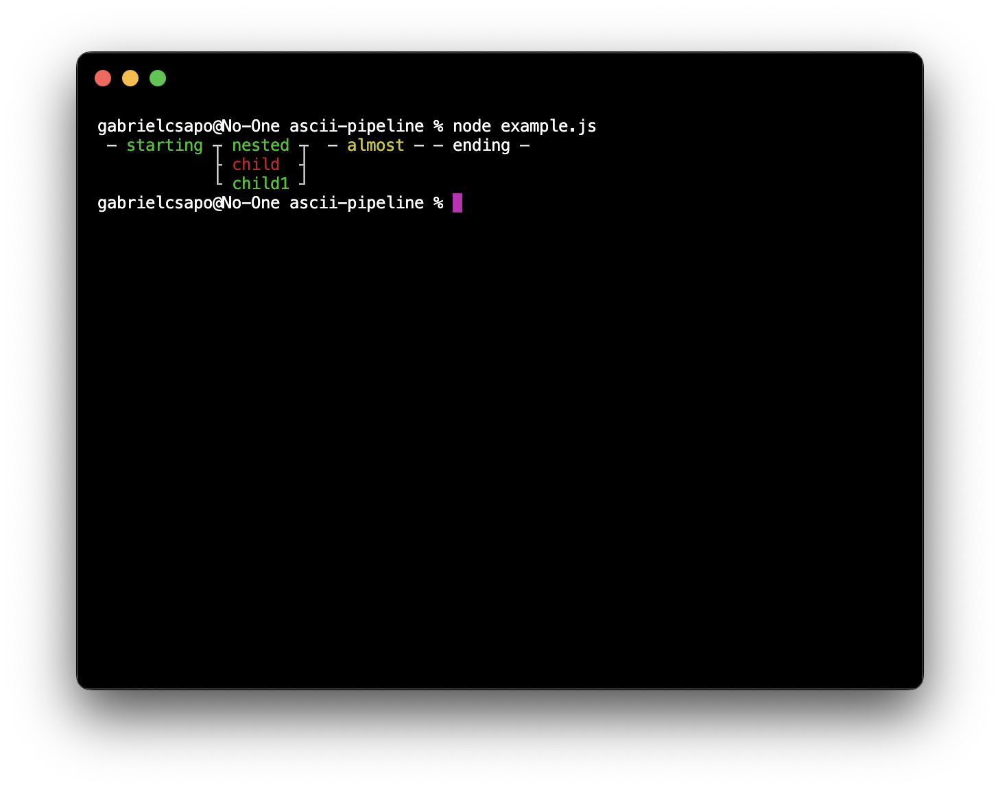

# ascii-pipeline

> 📟 ascii pipelines made easy

[](https://www.npmjs.com/package/ascii-pipeline)
[](https://travis-ci.org/gabrielcsapo/ascii-pipeline)
[](https://starbuck.gabrielcsapo.com/github/gabrielcsapo/ascii-pipeline)
[](https://starbuck.gabrielcsapo.com/github/gabrielcsapo/ascii-pipeline#info=devDependencies)
[](https://lcov-server.gabrielcsapo.com/coverage/github%2Ecom/gabrielcsapo/ascii-pipeline)
[]()
[]()

## Installation

```
npm install ascii-pipeline --save
```

## Usage

```js
const Pipeline = require('ascii-pipeline');

const pipe = new Pipeline([{
  name: 'starting',
  status: 'SUCCESS',
}, {
  name: 'nested',
  status: 'SUCCESS',
  children: [{
    name: 'child',
    status: 'FAIL'
  }, {
    name: 'child1',
    status: 'SUCCESS'
  }]
}, {
  name: 'ending',
  status: 'SUCCESS'
}]);

console.log(pipe.toString());
```

This will output:

```bash
─ starting ┬ nested ┬ ending ─
           ├ child  ┤         
           └ child1 ┘
```

Or the colorized version:

<p align="center">
  
</p>
